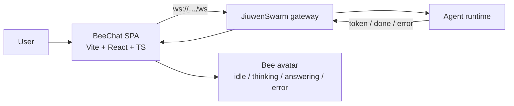

# BeeChat architecture

## Shape

BeeChat is a **client-only** channel. There is no server component: the web app talks
directly to a running JiuwenSwarm gateway over WebSocket, and the desktop shells are
thin native wrappers around the same web build.

One web build (`apps/web/dist`) serves three launchers and two views:

| Launcher | Location | What it is |
|---|---|---|
| Browser | `apps/web/` (`npm run dev`) | the app itself |
| Electron | `apps/desktop/electron/` | native shell (bundled Chromium + Node) |
| Tauri v2 | `apps/desktop/tauri/` | native shell (Rust + OS WebView2) |
| Android | `apps/mobile/` (Capacitor) | native app; opens in the avatar view and floats via Picture-in-Picture |

Views are selected by URL hash: no hash → full site; `#avatar` → the floating avatar
with inline chat (what the desktop shells open by default).

## Web app module map

| Module | Responsibility |
|---|---|
| `apps/web/src/app/` | Entry (`main.tsx`) and the two view roots (`App.tsx`) |
| `apps/web/src/components/avatar/` | Bee avatar renderings, the avatar-view shell, voice UI |
| `apps/web/src/components/chat/` | Message list, bubbles (Markdown + actions), composer, starter prompts |
| `apps/web/src/components/history/` | Conversation sidebar (search, rename, delete) |
| `apps/web/src/components/settings/` | Settings modal (theme, voice, gateway URL, agent, mode) |
| `apps/web/src/components/common/` | Toasts, command palette, language toggle, shared primitives |
| `apps/web/src/gateway/protocol.ts` | Shared types: `Envelope`, `GatewayStatus`, `GatewayEvents`, `ChatGateway`, `WebSocketLike` |
| `apps/web/src/gateway/gateway.ts` | SDK gateway client (`/v1/ws` envelope protocol) + reconnect |
| `apps/web/src/gateway/gatewayProduct.ts` | Product gateway client (`/ws` event/req protocol) |
| `apps/web/src/gateway/config.ts` | `VITE_*` defaults + `resolveConfig(settings)` |
| `apps/web/src/settings/` | Persisted `UserSettings` (theme, gateway URL, agent, mode, voice) + provider |
| `apps/web/src/chat/` | `useChat` (gateway + conversation orchestration), pure message/conversation reducers, local storage, drafts |
| `apps/web/src/avatar/` | Pure avatar state machine + style preference |
| `apps/web/src/platform/` | Desktop-shell bridge (`window.bee` / `__TAURI__`) and Web Speech TTS |
| `apps/web/src/theme/` | Theme resolution (`light`/`dark`/`system`) and `tokens.css` |
| `apps/web/src/lib/` | Small pure helpers: clipboard, Markdown stripping, code highlighting |
| `apps/web/public/` | PWA manifest, icon, and the offline service worker (`sw.js`) |

Conversations, drafts, settings, avatar style and language are all stored in
`localStorage`; nothing is sent to the gateway beyond the existing chat frames. The
gateway layer is unchanged, so no backend work is required.

Dependency direction: `components → chat/avatar/platform → gateway`. The `gateway/`
folder is the only place that knows about WebSocket framing; the rest of the app talks
to the `ChatGateway` interface.

## Gateway protocols

BeeChat speaks **two** gateway protocols and picks the first reachable target from
`config.targets`, unless `VITE_JIUWENSWARM_URL` pins one.

### SDK gateway — `/v1/ws` (envelope protocol)

`type`-discriminated JSON, framed in `gateway.ts`.

| Direction | `type` | Key fields |
|---|---|---|
| client → server | `connect` | `client_type`, optional `token` |
| client → server | `create_session` | `agent_id`, `title`, `mode` |
| client → server | `chat` | `message`, optional `session_id` |
| server → client | `ack` | `protocol_version`, `session_id` |
| server → client | `session_created` | `session` |
| server → client | `token` | `text` |
| server → client | `done` | `session_id` |
| server → client | `error` | `message` |

### Product gateway — `/ws` (event/req protocol)

Framed in `gatewayProduct.ts`.

| Direction | Frame | Key fields |
|---|---|---|
| server → client | `event connection.ack` | `payload.session_id`, `payload.mode` |
| client → server | `req chat.send` | `params.session_id`, `params.content`, `params.mode` |
| server → client | `event chat.delta` | `payload.content` |
| server → client | `event chat.final` | `payload.content` |
| server → client | `event chat.processing_status` | `payload.is_processing` |
| server → client | `event chat.error` | `payload.message` |

Default targets (see `config.ts`), tried in order:

1. `ws://127.0.0.1:19000/ws` — product gateway (`jiuwenswarm-start`)
2. `ws://127.0.0.1:19001/v1/ws` — SDK gateway (`python -m openjiuwen.gateway`)
3. `ws://127.0.0.1:19000/v1/ws` — SDK gateway on the documented port

All endpoints use `127.0.0.1`, not `localhost`: the gateway binds IPv4 only and
browsers may resolve `localhost` to `::1` first.

## Desktop shells

Both shells load the same `apps/web/dist` and add only OS behaviour:

| Concern | Electron (`apps/desktop/electron/`) | Tauri (`apps/desktop/tauri/`) |
|---|---|---|
| Shell language | JavaScript (`main.js`) | Rust (`src-tauri/src/main.rs`) |
| Expand/collapse | `setBounds` over IPC | `set_size` via `set_avatar_expanded` |
| Bridge | `preload.js` (`window.bee`) | `window.__TAURI__.core.invoke` |
| Window state | JSON in `userData` | JSON in `app_config_dir` |

The web app detects the shell in `apps/web/src/platform/desktop.ts`; in a plain browser both
bridges are no-ops.

The Android app (`apps/mobile/`) is a Capacitor wrapper around the same `apps/web/dist`. It opens
into the avatar view (`isNativeApp()` in `platform/desktop.ts` makes an empty hash mean
"avatar"). When the user leaves the app, `OverlayService` adds a transparent, draggable,
interactive `TYPE_APPLICATION_OVERLAY` window (a WebView at `#avatar`) so the bee floats
over other apps and its inline chat works; `window.AndroidBee.setExpanded(...)` resizes
it. If the overlay permission isn't granted, `MainActivity` falls back to
Picture-in-Picture. Cleartext is enabled for the LAN `ws://` gateway.

Voice is native on Android: `VoiceBridge` exposes `window.AndroidVoice` (Android
`TextToSpeech` + `SpeechRecognizer`) and pushes events through `window.__beeVoice`, so
`apps/web/src/platform/speech.ts` and `recognition.ts` prefer it over the Web Speech API when
present. The same bridge is installed in both the activity and the overlay WebView.
