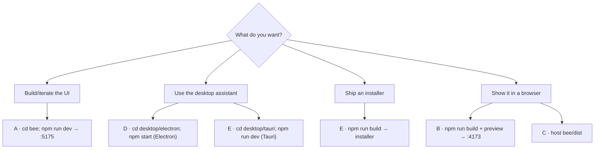

# BeeChat — how to run everything

One web app, **three launchers**, **two views**. This documents every run mode so you don't have to remember.

---

## The mental model

| Layer | Folder | What it is |
|---|---|---|
| **Web app** (the only real app) | `bee/` | Vite + React + TS: UI, chat, avatar, voice, gateway client. Builds to `bee/dist`. |
| **Electron shell** | `desktop/electron/` | Native wrapper around the web app (bundled Chromium + Node). |
| **Tauri shell** | `desktop/tauri/` | Native wrapper around the web app (Rust + OS WebView2), tiny. |

The shells contain almost no product code — they load `bee/dist` (or the web dev server) and only add OS behavior: transparent always-on-top window, tray, hotkeys, click-through, resize.

**Effective order:** change `bee/` → all three update. Touch `desktop*/` only for OS/window behavior.

---

## The two views

Both views are the *same app*, chosen by the URL hash:

| URL | View |
|---|---|
| `.../` (no hash) | **Full site** — header, status, bee welcome avatar, message list, composer, New chat, offline/reconnect, jump-to-latest |
| `.../#avatar` | **Avatar view** — the character + inline bubble/input + voice; no header |

The desktop shells open the **avatar view** by default and can open the full site on demand (tray → "Open full chat window", or `Ctrl+Shift+B`).

---

## Run modes

### A. Web — development server (fastest, hot reload)

```powershell
cd bee
npm run dev
```

| | |
|---|---|
| URL | **http://localhost:5175/** (full) · **http://localhost:5175/#avatar** (avatar) |
| Loads | source with hot reload |
| Needs | Node only |
| Stop | Ctrl+C |

### B. Web — production build + preview

```powershell
cd bee
npm run build
npm run preview
```

| | |
|---|---|
| URL | **http://localhost:4173/** (default Vite preview port) |
| Loads | `bee/dist` |
| Needs | Node only |

### C. Web — static hosting

`bee/dist` is a plain static site (relative asset paths). Upload its contents to any web server / static host and open `index.html` (add `#avatar` for the avatar view).

### D. Electron desktop

```powershell
cd desktop/electron
npm install
npm start            # production: loads ../../bee/dist
# or
npm run start:dev    # dev: loads the Vite dev server (run A first)
```

| | |
|---|---|
| Window | transparent, always-on-top **avatar** (drag by the top grip) |
| Extra | tray (show/hide, open full chat, click-through, quit); `Ctrl+Shift+H` show/hide, `Ctrl+Shift+B` full chat |
| Loads | `app://bee/index.html#avatar` (prod) or `http://localhost:5175` (dev) |
| Needs | Node only |
| Point elsewhere | set `BEECHAT_URL` (e.g. `http://localhost:5175`) |

### E. Tauri desktop

```powershell
cd desktop/tauri
npm install
npm run dev          # runs the web dev server + native shell
npm run build        # release installer → src-tauri/target/release/bundle/
```

| | |
|---|---|
| Window | same transparent always-on-top avatar |
| Loads | dev URL `http://localhost:5175` (dev) or `../bee/dist` (build) |
| Needs | **Rust** + **MSVC C++ build tools** + WebView2 (all present on this machine) |
| Icons | `npm run icon` before packaging |

> If `cargo` is "not recognized", open a **new** terminal (PATH) or run:
> `$env:Path = "$env:USERPROFILE\.cargo\bin;$env:Path"`

> Packaging into an installer is covered in [`packaging.md`](packaging.md).

---

## Which should you use?

| Goal | Use |
|---|---|
| Build/iterate on the UI | **A** (web dev) — then the desktop shells can point at it |
| Try the desktop assistant | **D** (Electron, no toolchain) |
| Ship a small Windows installer | **E** (Tauri) |
| Show it to someone online | **C** (static host of `bee/dist`) |

You never run all of them at once. Normally: **one** web dev server *or* **one** desktop shell.

---

## Prerequisites (all modes)

| Need | Why |
|---|---|
| **JiuwenSwarm gateway** running | the app connects to it for chat |
| Gateway URL | default tries `ws://127.0.0.1:19000/ws` (product) then the SDK gateways; override in `bee/.env` with `VITE_JIUWENSWARM_URL` |
| Node 18+ | web app and shells |
| Rust + MSVC (Tauri only) | compiling the native shell |

If the header says **Offline**, the gateway isn't reachable — see the URL shown in the offline card (use `127.0.0.1`, not `localhost`; the gateway binds IPv4 only).

---

## Decision flow



---

## Quick reference

| Mode | Command | URL / result | Needs |
|---|---|---|---|
| A Web dev | `cd bee && npm run dev` | http://localhost:5175/ · `/#avatar` | Node |
| B Web preview | `cd bee && npm run build && npm run preview` | http://localhost:4173/ | Node |
| C Web static | host `bee/dist` | your host | any static host |
| D Electron | `cd desktop/electron && npm start` | avatar window (tray/hotkeys) | Node |
| D' Electron dev | `cd desktop/electron && npm run start:dev` | loads :5175 | Node + A running |
| E Tauri dev | `cd desktop/tauri && npm run dev` | avatar window | Rust + MSVC |
| E' Tauri build | `cd desktop/tauri && npm run build` | installer in `target/release/bundle` | Rust + MSVC |
