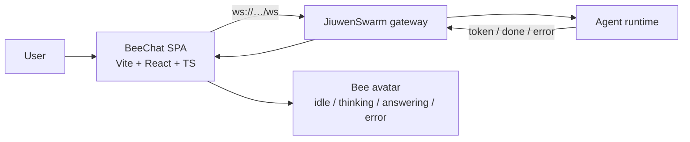

# BeeChat architecture

## Shape

BeeChat is a **client-only** channel. There is no server component: the web app talks
directly to a running JiuwenSwarm gateway over WebSocket, and the desktop shells are
thin native wrappers around the same web build.

One web build (`bee/dist`) serves three launchers and two views:

| Launcher | Location | What it is |
|---|---|---|
| Browser | `bee/` (`npm run dev`) | the app itself |
| Electron | `desktop/electron/` | native shell (bundled Chromium + Node) |
| Tauri v2 | `desktop/tauri/` | native shell (Rust + OS WebView2) |

Views are selected by URL hash: no hash → full site; `#avatar` → the floating avatar
with inline chat (what the desktop shells open by default).

## Web app module map

| Module | Responsibility |
|---|---|
| `bee/src/app/` | Entry (`main.tsx`) and the two view roots (`App.tsx`) |
| `bee/src/components/avatar/` | Bee avatar renderings, the avatar-view shell, voice UI |
| `bee/src/components/chat/` | Message list, bubble, composer |
| `bee/src/gateway/protocol.ts` | Shared types: `Envelope`, `GatewayStatus`, `GatewayEvents`, `ChatGateway`, `WebSocketLike` |
| `bee/src/gateway/gateway.ts` | SDK gateway client (`/v1/ws` envelope protocol) + reconnect |
| `bee/src/gateway/gatewayProduct.ts` | Product gateway client (`/ws` event/req protocol) |
| `bee/src/gateway/config.ts` | `VITE_*` config and the ordered list of gateway targets |
| `bee/src/chat/` | `useChat` (React hook) and pure message reducers |
| `bee/src/avatar/` | Pure avatar state machine + style preference |
| `bee/src/platform/` | Desktop-shell bridge (`window.bee` / `__TAURI__`) and Web Speech TTS |
| `bee/src/theme/tokens.css` | Light/dark design tokens (no hardcoded colours in components) |

Dependency direction: `components → chat/avatar/platform → gateway`. The `gateway/`
folder is the only place that knows about WebSocket framing; the rest of the app talks
to the `ChatGateway` interface.

## Gateway protocols

BeeChat speaks **two** gateway protocols and picks the first reachable target from
`config.targets`, unless `VITE_JIUWENSWARM_URL` pins one.

### SDK gateway — `/v1/ws` (envelope protocol)

`type`-discriminated JSON, framed in `gateway.ts`.

| Direction | `type` | Key fields |
|---|---|---|
| client → server | `connect` | `client_type`, optional `token` |
| client → server | `create_session` | `agent_id`, `title`, `mode` |
| client → server | `chat` | `message`, optional `session_id` |
| server → client | `ack` | `protocol_version`, `session_id` |
| server → client | `session_created` | `session` |
| server → client | `token` | `text` |
| server → client | `done` | `session_id` |
| server → client | `error` | `message` |

### Product gateway — `/ws` (event/req protocol)

Framed in `gatewayProduct.ts`.

| Direction | Frame | Key fields |
|---|---|---|
| server → client | `event connection.ack` | `payload.session_id`, `payload.mode` |
| client → server | `req chat.send` | `params.session_id`, `params.content`, `params.mode` |
| server → client | `event chat.delta` | `payload.content` |
| server → client | `event chat.final` | `payload.content` |
| server → client | `event chat.processing_status` | `payload.is_processing` |
| server → client | `event chat.error` | `payload.message` |

Default targets (see `config.ts`), tried in order:

1. `ws://127.0.0.1:19000/ws` — product gateway (`jiuwenswarm-start`)
2. `ws://127.0.0.1:19001/v1/ws` — SDK gateway (`python -m openjiuwen.gateway`)
3. `ws://127.0.0.1:19000/v1/ws` — SDK gateway on the documented port

All endpoints use `127.0.0.1`, not `localhost`: the gateway binds IPv4 only and
browsers may resolve `localhost` to `::1` first.

## Desktop shells

Both shells load the same `bee/dist` and add only OS behaviour:

| Concern | Electron (`desktop/electron/`) | Tauri (`desktop/tauri/`) |
|---|---|---|
| Shell language | JavaScript (`main.js`) | Rust (`src-tauri/src/main.rs`) |
| Expand/collapse | `setBounds` over IPC | `set_size` via `set_avatar_expanded` |
| Bridge | `preload.js` (`window.bee`) | `window.__TAURI__.core.invoke` |
| Window state | JSON in `userData` | JSON in `app_config_dir` |

The web app detects the shell in `bee/src/platform/desktop.ts`; in a plain browser both
bridges are no-ops.
