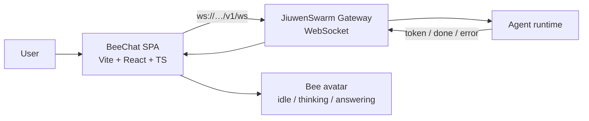
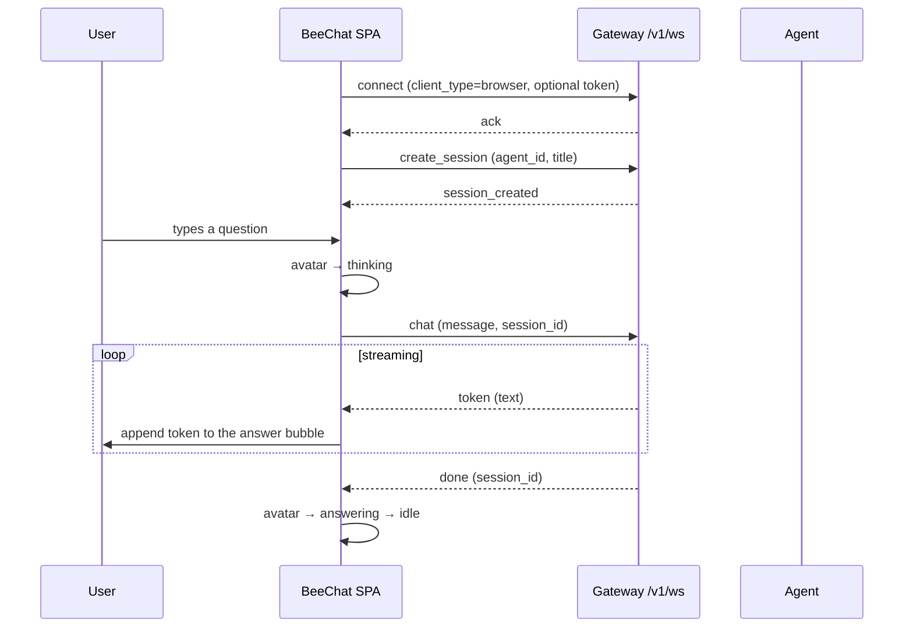
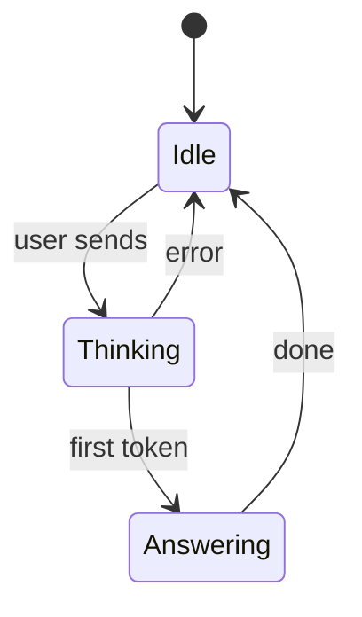
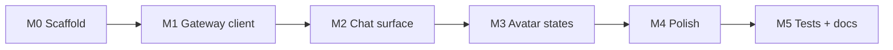

# BeeChat — a simple bee-avatar chatbot channel

> Historical design/plan document, kept for context. Some paths predate the current
> layout (the repo now uses `desktop/electron/` and `desktop/tauri/`, and the web app
> source is split by domain). See [../architecture.md](../architecture.md) for the
> current module map.

A plan for a new sibling channel under `C:\Workspace\openjiuwenchannels`, alongside `jiuwenswarm-browser`, `jiuwenswarm-ide`, `jiuwenswarm-jupyterlab`, `jiuwenswarm-sdk`, `jiuwenswarm-vibestudio`, and `Tripwise`.

---

## 1. What it is

A **single-screen browser chatbot**: a bee avatar (the JiuwenSwarm mascot) hosts a plain **question-and-answer** conversation. No panels, no tool-call viewer, no trajectory, no settings sprawl — just a chat, a streaming reply, and an avatar that reacts. It talks to the JiuwenSwarm gateway over the same `/v1/ws` WebSocket envelope protocol the SDK uses.

The pitch: *the smallest possible "hello, JiuwenSwarm" app, made friendly by the mascot.*

---

## 2. Name

| Option | Why | Verdict |
|---|---|---|
| **BeeChat** (`jiuwenswarm-bee`) | literal, self-explanatory, matches the `jiuwenswarm-*` family | **recommended** |
| **BeeLine** | pun on "beeline"; also "line" = chat | good, more brandy |
| **Hive** | the swarm's home; reinforces the collective | good, less literal |
| **Buzz** | the bee's sound = "chat" | playful, vague |
| **JiuwenBee** | literal product name | safe fallback |

Recommendation: repo/folder **`jiuwenswarm-bee`**, product name **BeeChat**, avatar name **"Buzz"**. Alternatives above if the brand team prefers.

---

## 3. Theme assets (already exist)

The mascot already ships in the main web frontend:

| Asset | Path | Use today |
|---|---|---|
| `bee-static.png` | `jiuwenswarm/channels/web/frontend/src/assets/bee-static.png` | idle welcome banner |
| `bee-flying.webp` | `.../src/assets/bee-flying.webp` | "flying" state on hover |

Current behavior in `ChatPanel/index.tsx`: a `BeeBanner` shows the static bee, swaps to the flying bee on hover for `BEE_ANIMATION_DURATION = 4536 ms`, then reverts. CSS: `.chat-welcome__banner--bee` (≈200 px wide, `mix-blend-mode: multiply`, clickable).

**Reuse:** copy both assets into the new channel. **Add (small asset task):** ideally one more state so the avatar can show *thinking* vs *answering* — e.g. a `bee-talking` frame set. If no new art is available, map: idle → `bee-static`, thinking → `bee-flying` (looping), answering → `bee-static` + a speech bubble. Keep animations optional (`prefers-reduced-motion`).

---

## 4. Scope and non-goals

| In scope | Out of scope |
|---|---|
| One conversation surface (bubbles + input) | Tool-call / artifact / trajectory panels |
| Streaming token display | Multi-agent / team topology views |
| Reactive bee avatar | File upload, code mode, skills, cron |
| Session create / chat / reconnect | Full settings page (only a small connection panel) |
| Light + dark, mobile layout | Marketplace, hooks, history search |
| Plain Q&A (no attachments) | Auth beyond an optional gateway token |

---

## 5. Architecture



Everything is client-side except the gateway; there is no new server component. This mirrors `jiuwenswarm-vibestudio`, which also runs a Vite app against a running JiuwenSwarm gateway.

---

## 6. Message flow



On `error`, show a friendly bubble and reset the avatar.

---

## 7. Avatar states



| State | Trigger | Avatar |
|---|---|---|
| Idle | waiting, empty input | `bee-static` |
| Thinking | after send, before first token | `bee-flying` (loop) |
| Answering | stream in progress | static bee + speech bubble / subtle pulse |
| Error | `error` envelope or socket drop | static bee + alert bubble, auto-reconnecting |

---

## 8. UI / UX

- **Layout:** centered column, max ~720 px; the bee sits above the conversation; header shows the product name and a tiny connection dot.
- **Conversation:** only two bubble kinds — user (right) and bee/assistant (left). Markdown rendering for the answer only (no code-run, no artifacts).
- **Streaming:** tokens append live; a caret/typing shimmer while streaming; auto-scroll only when the user is already at the bottom.
- **Empty state:** the bee waves with a one-line prompt ("Ask me anything").
- **Errors:** never a raw stack — a short message plus a "try again" affordance.
- **Mobile:** full-width, input pinned to the bottom, safe-area aware.
- **Theming:** light/dark via semantic tokens (follow the frontend `AGENTS.md` color rule: no hardcoded product colors; tokens in theme files only).
- **Accessibility:** keyboard operable, `aria-live="polite"` on the streaming answer, avatar marked decorative, honor `prefers-reduced-motion`.
- **Data test ids:** follow the `data-testid` rules (`beeline-*` / `bee-*` prefix, register in the prefix table).

---

## 9. Tech stack and repository layout

Match `jiuwenswarm-vibestudio` (Vite + React + TypeScript + Vitest).

```
openjiuwenchannels/
  jiuwenswarm-bee/
    bee/                     # Vite/React app (src, tests, public, configs)
      src/
        assets/              # bee-static.png, bee-flying.webp
        components/Avatar/   # the bee + state machine
        components/Chat/     # bubbles, input, streaming
        lib/gateway.ts       # WebSocket envelope client
        theme/               # tokens (light/dark)
      tests/
    docs/                    # user docs (en + zh)
    internal/                # working/design docs
    README.md
```

---

## 10. Gateway contract (already specified)

Envelopes are JSON objects with a `type` discriminator, over `ws://localhost:19000/v1/ws`.

| Direction | `type` | Key fields |
|---|---|---|
| → server | `connect` | `client_type`, optional `token` |
| → server | `create_session` | `agent_id`, `title`, `mode` |
| → server | `chat` | `message`, optional `session_id` |
| ← client | `ack` | `protocol_version`, `session_id` |
| ← client | `session_created` | `session` |
| ← client | `token` | `text` |
| ← client | `done` | `session_id` |
| ← client | `error` | `message` |

The client only needs a thin `gateway.ts` that wraps these frames; no re-implementation of the SDK.

---

## 11. Configuration

| Variable | Default | Purpose |
|---|---|---|
| `VITE_JIUWENSWARM_URL` | `ws://localhost:19000/v1/ws` | gateway endpoint |
| `VITE_GATEWAY_TOKEN` | *(empty)* | optional token for the `connect` frame |
| `VITE_AGENT_ID` | `researcher` | agent used by `create_session` |
| `VITE_APP_TITLE` | `BeeChat` | brand title |

---

## 12. Milestones

| # | Milestone | Deliverable | Gate |
|---|---|---|---|
| M0 | Scaffold | Vite/React/TS app, theme tokens, bee assets | `npm run dev` shows the bee + empty state |
| M1 | Gateway client | `gateway.ts`, connect / create_session / chat / reconnect | tokens stream into a bubble against a live gateway |
| M2 | Chat surface | bubbles, input, streaming, auto-scroll, errors | full Q&A round-trip works |
| M3 | Avatar states | idle / thinking / answering / error mapped to frames | avatar follows the state machine |
| M4 | Polish | dark mode, mobile, a11y, reduced motion | passes manual checklist + a11y pass |
| M5 | Tests & docs | Vitest unit tests, README, user docs (en/zh) | CI green; docs reproduce a running app |



---

## 13. Testing and verification

- **Unit:** gateway envelope encode/decode; state-machine transitions (Idle→Thinking→Answering→Idle, error path); token accumulation.
- **Component:** send a message, assert a streaming bubble and avatar state changes; assert error bubble on `error`.
- **E2E (manual/later):** run JiuwenSwarm, open BeeChat, ask a question, confirm the streamed answer and avatar behavior.
- **Lint/type/build:** `npm run typecheck`, `npm test`, `npm run build`.

---

## 14. Risks

| Risk | Mitigation |
|---|---|
| Only two bee poses exist | start with 2-state mapping; request extra art as a follow-up |
| Gateway protocol drifts | isolate all framing in `gateway.ts`; version via `ack.protocol_version` |
| Scope creep into a "full" client | the non-goals table is the contract; reject panels |
| Brand color rules | use semantic theme tokens only, per frontend `AGENTS.md` |
| Reconnect storms | exponential backoff, single in-flight reconnect, visible status dot |

---

## 15. Why it fits the channel family

| Channel | Role |
|---|---|
| `jiuwenswarm-browser` / `-ide` / `-jupyterlab` | embed the agent in a host tool |
| `jiuwenswarm-vibestudio` | a rich app-builder surface |
| `Tripwise` | a domain demo over multiple backends |
| **`jiuwenswarm-bee` (BeeChat)** | the **minimal, friendly** channel: one screen, one avatar, plain Q&A |

It is the smallest complete example of "build a JiuwenSwarm channel", and the only one that leads with the mascot.
